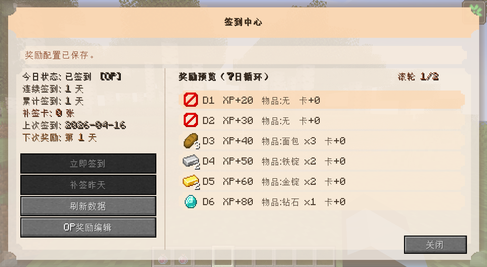
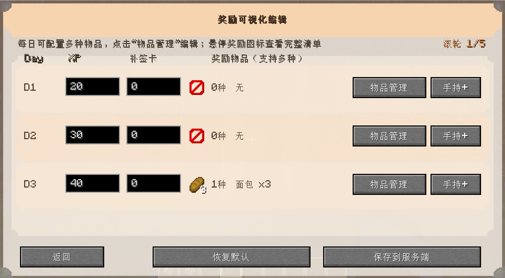
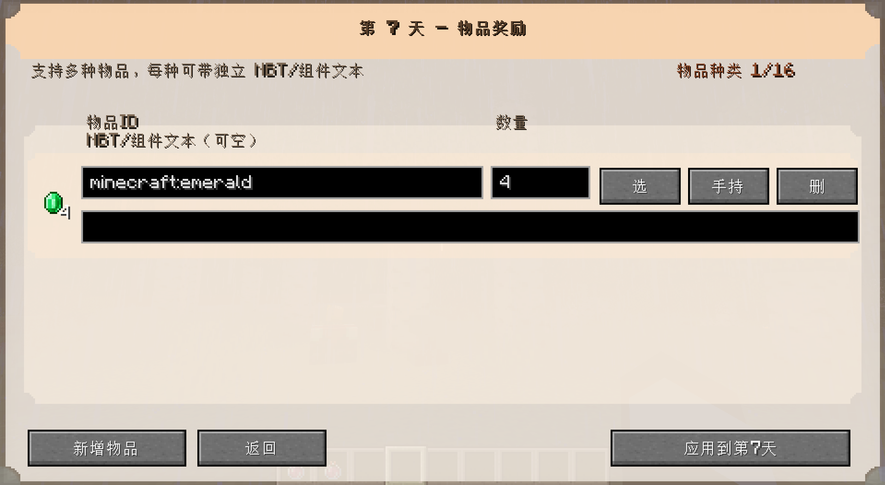

# Signin Mod (Fabric 1.20.1)

Daily sign-in mod for Minecraft Fabric 1.20.1, with client GUI + server data sync.

- 中文介绍: [README.zh.md](./README.zh.md)
- English (US): [README.us.md](./README.us.md)

## UI 参考图

> 注：以下图片来自 `img/` 目录，用于展示当前 UI 设计参考，实际效果会随版本迭代调整。

### 1. 签到主界面

注释：展示签到状态、奖励预览和玩家常用操作入口（签到/补签/刷新/编辑）。

### 2. 奖励可视化编辑界面

注释：用于 OP 编辑每日奖励，包含经验、补签卡、物品管理与手持快速录入。

### 3. 每日物品奖励编辑界面

注释：用于配置单日多物品奖励，支持物品 ID、数量、NBT/组件数据编辑与预览。

## License

This project uses the license in [LICENSE](./LICENSE).
